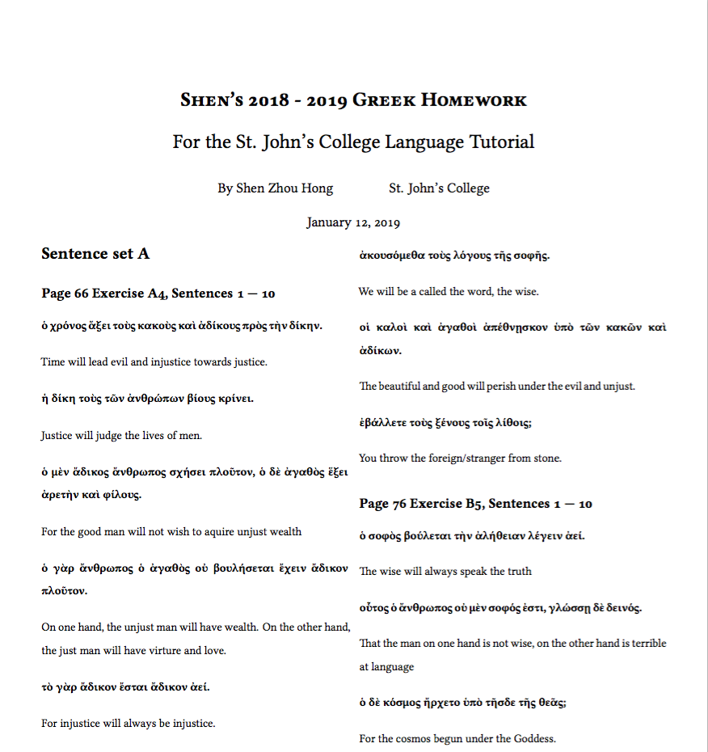

# 2018 - 2019 Winter Break Greek Homework



St. John's College 2018 - 2019 Winter Break homework for the Freshman Language Tutorial. 60 exercises from C.A.E. Luschnig's Introduction to Ancient Greek: A Literary Approach. Completed by Shen Zhou Hong

**Note: This is the code repository for the LaTeX document. To view the compiled PDF, [please click on this link here](./latex/shen-greek-hw.pdf).**

### Message to confused Classics students stumbling upon this from Google
Hello there.

As a Classics student, I too have found myself getting stuck at certain obscure sentences, often agonizing over them as a certain sentence simply doesn't make sense. Oftentimes, as a desperate measure, one would try pasting said sentence into Google - in the vain hope that someone else has attempted them before.

Well, if that's how you were lead to this document... I hope it'll be of use! Please recognize that the translations here are my best attempt for a homework assignment over the Winter break, and while I tried my absolute best, I cannot guarantee if any of these sentences are 100% accurate. In fact, I'd say that 80% of these sentences are 80% accurate, and 20% of them only 20% good.

So please don't copy them blindly, but do the translations yourself - and let my sentences serve only as a guide towards the right direction, when all else is lost.

And of course, if you spot any errors or bad translations in my responses, do submit a pull request, or otherwise let me know. I'll be happy to make corrections! :)

### Compiling document
In order to compile latex source files, run `make` in the terminal:
```
cd latex
make
make clean
```

Note: for any partial compiles where compilation fails at a certain point, you
should run `make clean` followed by make again. Trying to run make after a
failed compile would result in additional errors.

### Dependencies
This template uses a makefile to compile the latex source files. The makefile
uses `latexmk`, which runs latex the correct number of times. This is because
due to the presense of figures, tables, and biblatex databases, latex needs to
be called multiple times in some cases. Latexmk should be included in your
latex installation, but if it is now, you may download it here:

* http://personal.psu.edu/jcc8//software/latexmk-jcc/

Additionally, this template uses XeLaTeX by default, as it allows the inclusion
of unicode characters in the latex source files. If XeLaTeX is not installed, or
plain LaTeX is required, simply alter the `makefile` at the appropriate call:

```
# MAIN LATEXMK RULE
$(source_name).pdf: $(source_name).tex
  ...
	latexmk -pdf -xelatex -use-make $<
```

XeLaTeX allows one to use foreign characters like ü or æ natively in the latex
source files, though. So it's probably a good idea to install XeLaTeX:

* http://xetex.sourceforge.net/

### Related documentation
For an overview of how to populate biblatex `citations.bib` files, visit the
biblatex-mla manual at CTAN.

* https://www.ctan.org/pkg/biblatex-mla

### Copyright
The assigned sentences are excerpts from C.A.E. Luschnig's Introduction to Ancient Greek: A Literary Approach. They are reproduced here under the fair use clause of U.S. Copyright law. The translated sentences are my own intellectual property.
